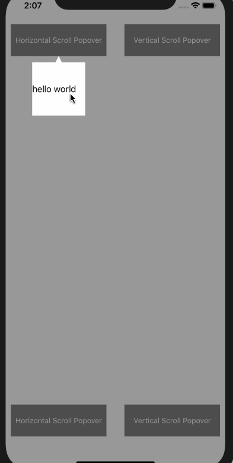

# ZMPopover

Popover component for iOS with Swift.

# Screenshot



# Setup

#### Install with [CocoaPods](http://cocoapods.org/)

```ruby
platform :ios, '9.0'
pod 'ZMPopover', '~> 0.1.0'
```

#### [Example](Example/Example/ViewController.swift)

# Configuration

* `viewController`
* `arrowSize`
* `popoverBgColor`

# API

* `func show(_ anchor: UIView, contentView: UIView, popoverSize: CGSize, popoverMargin: UIEdgeInsets, scrollOrientation: ScrollOrientation)`

# License

[MIT](LICENSE)